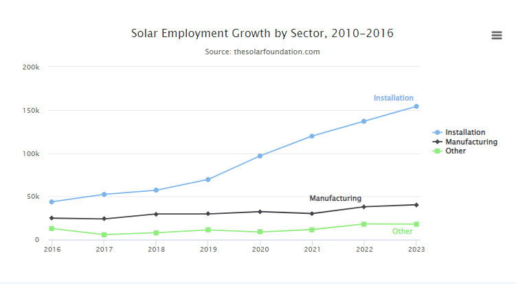
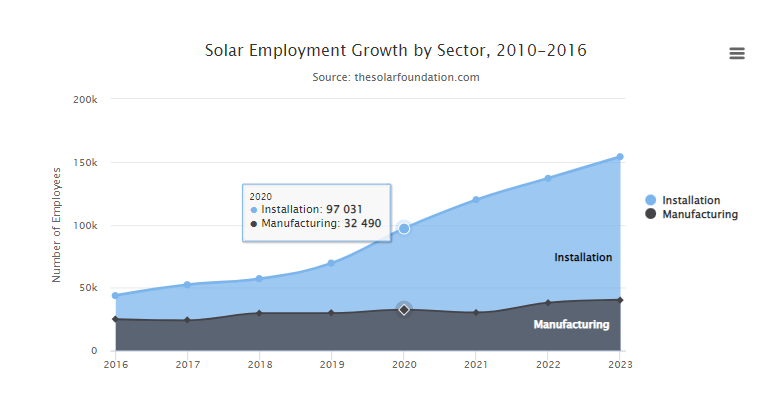
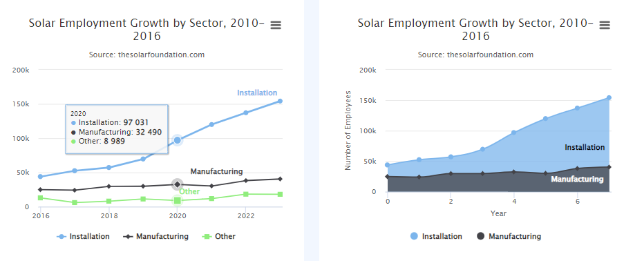
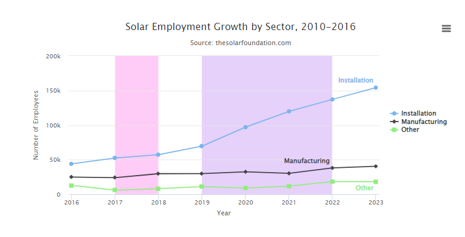

# pyhighcharts

I created this library to create beautifully grafted highcharts from python. I would gladly accept pointers from others to improve, simplify, or make the code more efficient. If you would like to make any comments then please feel free to email me at dev.ronithomas@gmail.com.

# Prerequisites
- python
- html
- javascript basics

# What is pyhighcharts?
It will allow you to create beautiful highcharts from python. It automatically saves the chart to a javascript file with name `charts.js`, which can be used in any html file.

# Inspiration
>`pandas-highcharts` [PypI](https://pypi.python.org/pypi/pandas-highcharts)

# Features
All features are addded to their respective dictonary and combined together
    in main dictonary, which is then saved as javascript code.
    'args' format:
```
args.get('user entered value', 'default value')
```

#### Chart Selection:
| Feature | Syntax | Default Value |
| ------ | ------ | ------ |
| chart type | `chart = str` | line |

#### Adding Titles:
| Feature | Syntax | Default Value |
| ------ | ------ | ------ |
| title | `title = str` | None |
| subtitle | `subtitle = str` | None |
| y-axis title | `ytitle = str` | None |
| x-axis title | `xtitle = str` | None |

#### Definining start point of x-axis:
Default start point for x-axis is 0.
To change start point, use:
`xpointStart = int`

#### Tooltip:
| Feature | Syntax | Default Value |
| ------ | ------ | ------ |
| tooltipShared | `tooltipShared = bool` | false |
| tooltipvalueSuffix | `tooltipvalueSuffix = str` | None |

#### Legend:
| Feature | Syntax | Default Value |
| ------ | ------ | ------ |
| enableLegend | `enableLegend = bool` | true |
| legendLayout | `legendLayout = str` | vertical |
| legendHorizontalAlign | `legendHorizontalAlign = str` | right |
| legendVerticalAlign | `legendVerticalAlign = str` | middle |

#### Vertical Plot Bands:
```py
HighCharts.plotBands(start, end, color)
```
`start` and `end` are integers, `color` is a string.
eg:
```py
HighCharts.plotBands(3, 4, 'rgba(255, 0, 217, 0.2)')
```

#### Width:
| Feature | Syntax | Default Value |
| ------ | ------ | ------ |
| maxWidth | `maxWidth = int` | 500 |

#### Credits:
| Feature | Syntax | Default Value |
| ------ | ------ | ------ |
| credits | `credits = bool` | false |
| creditsText | `creditsText = str` | None |

# Usage:
#### Creating a chart:

##### Example1: Line Plot
```py
name = ['Installation','Manufacturing','Other']
data = [
    [43934, 52503, 57177, 69658, 97031, 119931, 137133, 154175],
    [24916, 24064, 29742, 29851, 32490, 30282, 38121, 40434],
    [12908, 5948, 8105, 11248, 8989, 11816, 18274, 18111]
]
hc = HighChart(title = "Solar Employment Growth by Sector, 2010-2016",
    subtitle = "Source: thesolarfoundation.com", xpointStart = 2016,
    name=name, data=data, )
# if xpointStart is not defined, then it will be 0
hc.plotBands(4.5, 6.455, 'rgba(68, 170, 213, .2)')
hc.plotBands(1, 2, 'rgba(255, 0, 217, 0.2)')
hc.savehighchart() # saves chart to charts.js, default name is charts.js
```
##### Output:


##### Example2: Areaspline Plot
```py
name = ['Installation','Manufacturing']
data = [
    [43934, 52503, 57177, 69658, 97031, 119931, 137133, 154175],
    [24916, 24064, 29742, 29851, 32490, 30282, 38121, 40434]
]
hc = HighChart(chart="areaspline", title = "Solar Employment Growth by Sector, 2010-2016",
    subtitle = "Source: thesolarfoundation.com", ytitle = "Number of Employees",
    name=name, data=data, xpointStart=2016)
hc.savehighchart()
```
##### Output:


##### Example3: Multiple Plots
NOTE: For multiple plots please asign a value to container
```py
#chart 1
name1 = ['Installation','Manufacturing','Other']
data1 = [
    [43934, 52503, 57177, 69658, 97031, 119931, 137133, 154175],
    [24916, 24064, 29742, 29851, 32490, 30282, 38121, 40434],
    [12908, 5948, 8105, 11248, 8989, 11816, 18274, 18111]
]
hc1 = HighChart(title = "Solar Employment Growth by Sector, 2010-2016",
    subtitle = "Source: thesolarfoundation.com",
    name=name1, data=data1, xpointStart=2016)
hc1.savehighchart()

#chart 2
name2 = ['Installation','Manufacturing']
data2 = [
    [43934, 52503, 57177, 69658, 97031, 119931, 137133, 154175],
    [24916, 24064, 29742, 29851, 32490, 30282, 38121, 40434]
]
hc2 = HighChart(chart="areaspline", container='container-2', title = "Solar Employment Growth by Sector, 2010-2016",
    subtitle = "Source: thesolarfoundation.com", ytitle = "Number of Employees", xtitle = "Year",
    name=name2, data=data2)
hc2.savehighchart()
```
##### Output:


##### Example4: PlotBands
```py
name = ['Installation','Manufacturing','Other']
data = [
    [43934, 52503, 57177, 69658, 97031, 119931, 137133, 154175],
    [24916, 24064, 29742, 29851, 32490, 30282, 38121, 40434],
    [12908, 5948, 8105, 11248, 8989, 11816, 18274, 18111]
]
hc = HighChart( title = "Solar Employment Growth by Sector, 2010-2016",
    subtitle = "Source: thesolarfoundation.com", ytitle = "Number of Employees", xtitle = "Year",
    name=name, data=data, xpointStart=2016)
hc.plotBands(2017, 2018, 'rgba(255, 0, 217, 0.2)')
hc.plotBands(2019.5, 2022, 'rgba(132, 27, 233, 0.2)')
hc.savehighchart()
```
##### Output:


# Contact:
##### Email: ronithomas10@gmail.com
##### Email: dev.ronithomas@gmail.com
##### Github: devronithomas

### Thank You

Regards,
Roni Thomas